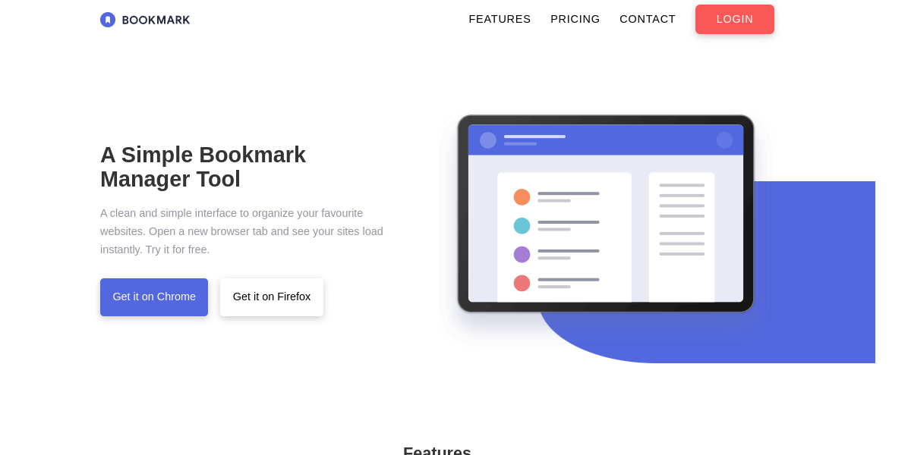

# Bookmark

<details>
  <summary>Preview</summary>
  
</details>

[Live demo (gitlab)](https://w973.gitlab.io/bookmark)

[Live demo (github)](https://nuckle.github.io/bookmark)

## Installation

Close this repository like this if you need PHPMailer submodule

```sh
git clone --recursive https://github.com/nuckle/bookmark.git
```

Or you can use this 

```sh
git clone https://github.com/nuckle/bookmark.git
cd bookmark/
git submodule update
```

## How to deploy 

```sh
npm i
npx gulp
```

## How to build 

```sh
npx gulp build 
```

All the files will be served at `dist/` directory
